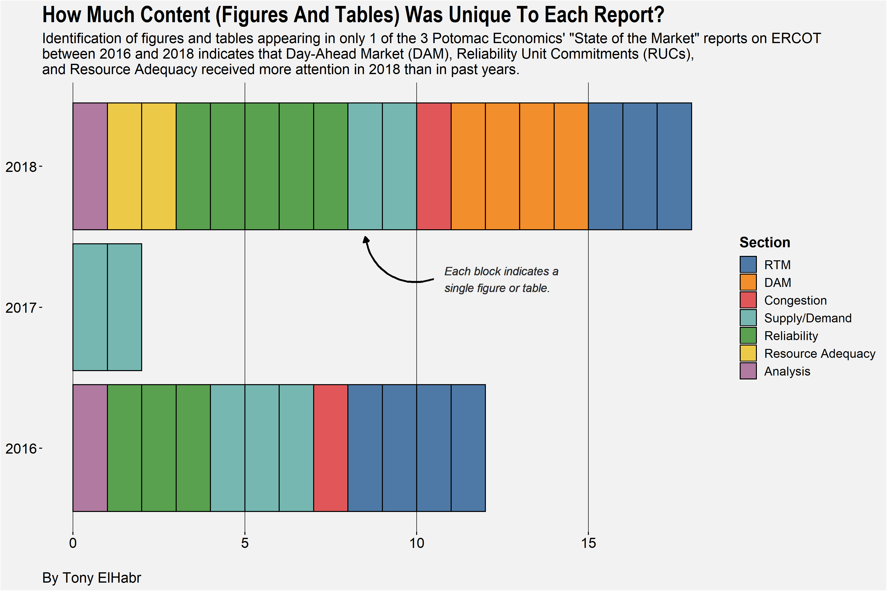
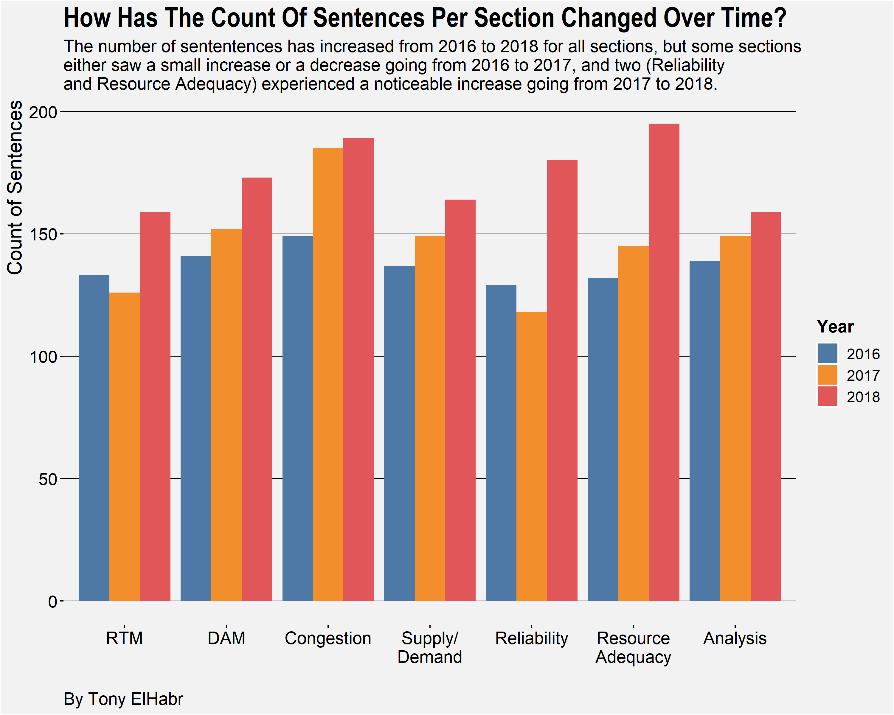
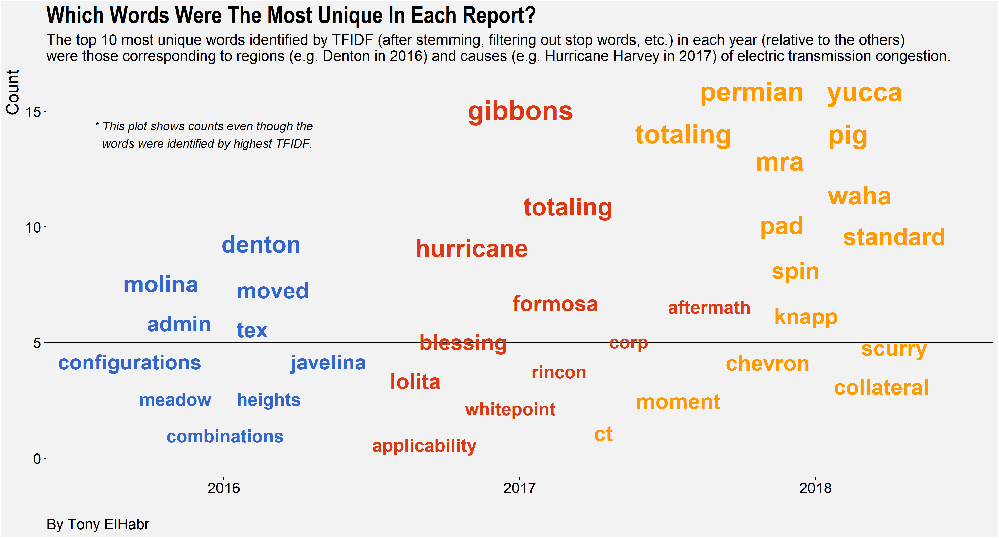

Analysis of ERCOT "State of the Market Reports" produced by Potomatic Economics.
(See https://www.potomaceconomics.com/markets-monitored/ercot/ for more details.)

This project was converted to [a blog post]() 
on [my website](https://tonyelhabr.rbind.io/).

## Highlights











Unfortunately, I haven't had as much time to make blog posts
in the past year or so. 
I started taking classes as part of 
[Georgia Tech's Online Masters in Analytics (OMSA)]()
program last summer (2018) while continuing to work full-time, so extra time
to code and write hasn't been abundant for me.

Anyways, I figured I would share one neat thing I learned to do
as a consequence of taking classes---writing compact cheatsheets in Rmarkdown.

Writing in Rmarkdown is fairly straightforward---mostly
thanks to an abundance of learning resources, like the 
[official Rmarkdown book]()---and using
CSS and/or Javascript to customize your Rmarkdown output to your liking
is not too difficult either [^1].
Anyways, I really wanted to make an **extremely** compact PDF
that minimized margin space and other "extra" white space
(in order to maximize the amount of space used for content).
I had a hard time getting an output that I liked purely from CSS,
so I looked online to see if I could find some good LaTex templates.
(After all, I would be knitting the Rmarkdown document to PDF,
and LaTex would be implicitly incorporated via the equations on the cheatsheet.)
Some templates I found worked ok, but weren't completely to my liking.

[^1] and is definitely worth your time

Thus, I "read the details" and decided to make my own LaTex template.
Using the template from [this Stack Overflow post] as a basis, I ended
up with a relatively minimal template that looks as follows.
(Feel free to copy-paste it and use it as you like.)

```

```


