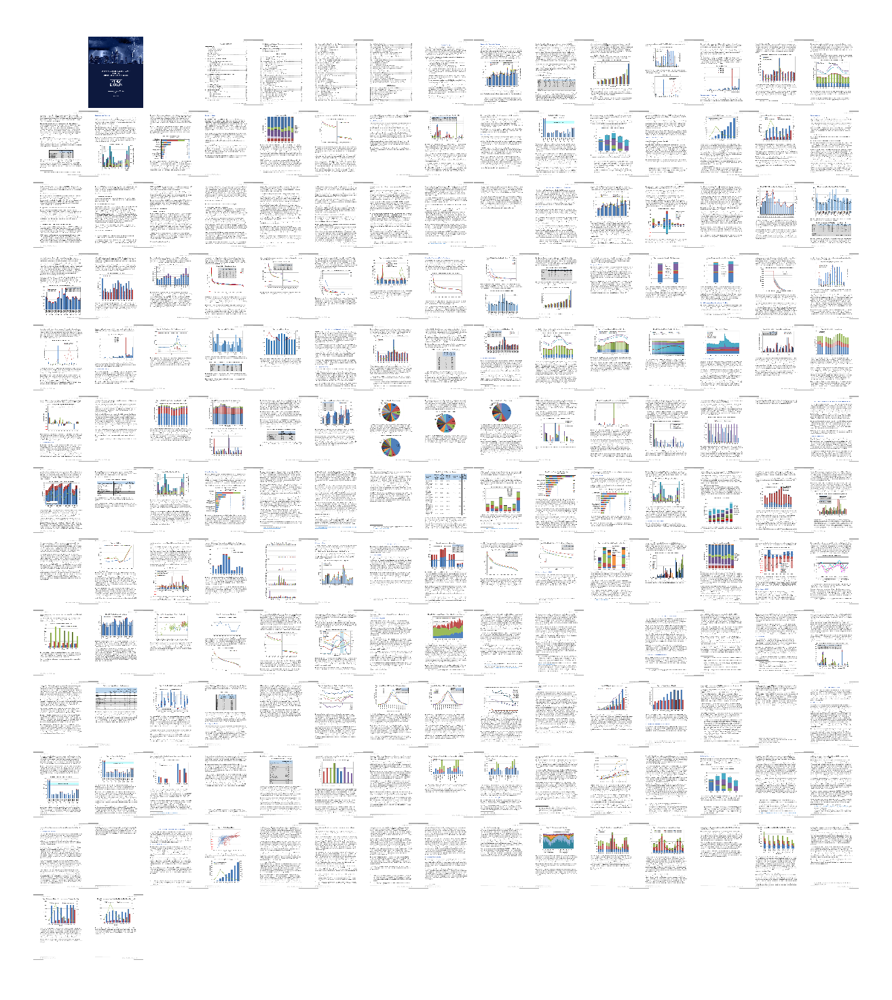
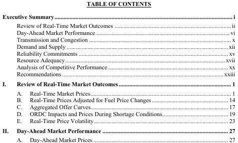
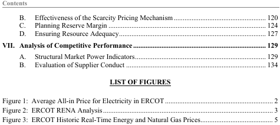
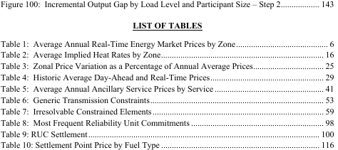
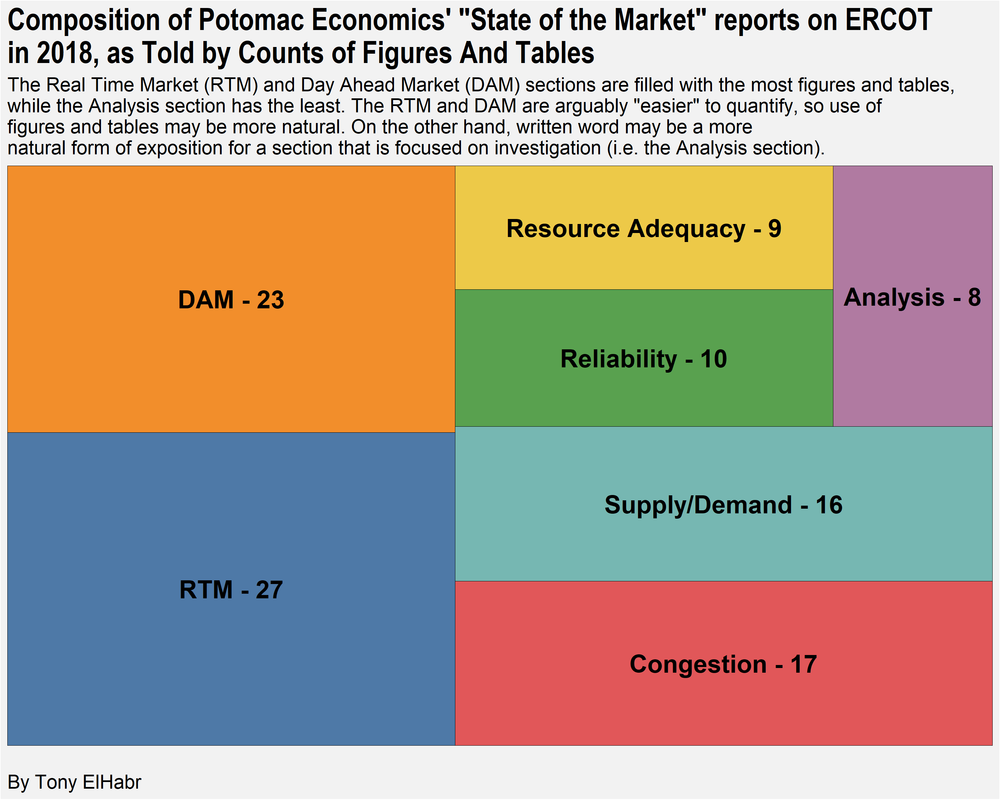
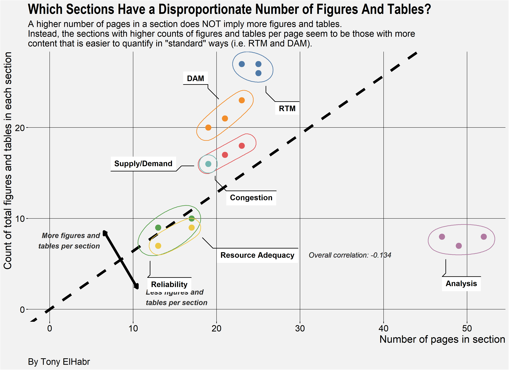
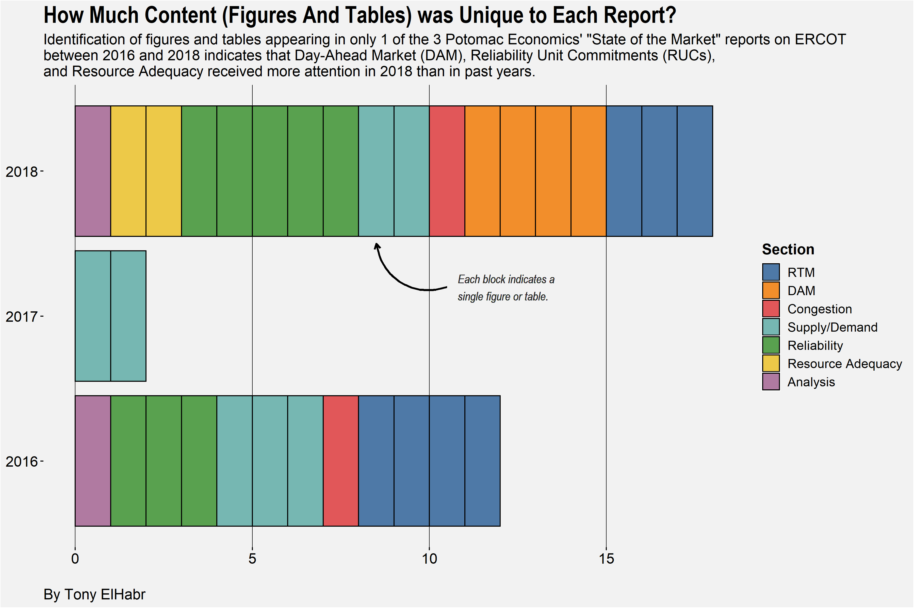
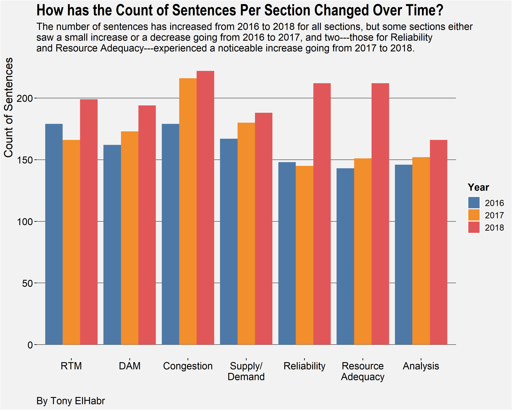

<style type="text/css">
hide {
  display: none;
}
</style>

```{r path_import, include=F, echo=F}
.path_import <- 'analysis/analysis.RData'
```


```{r setup-once, include=F, echo=F, eval=F}
if(!file.exists(.path_import)) {
  source('analysis/00-prep.R')
  source('analysis/01-setup.R')
  source('analysis/02-clean-toc.R')
  source('analysis/02-clean-body.R')
  # source('analysis/03-visualize-toc.R')
  # source('analysis/03-visualize-body.R')
  save.image(file = .path_import)
}
```

```{r setup-lazy, include=F, echo=F, eval=T}
if(file.exists(.path_import)) {
  load(.path_import)
}
```

## Some Context

Those of you non-academia folk who work in mid-size to large companies (like me)
are probably conscious of any/all periodic reports that an independent entity
publishes for your company's industry. For example, in the insurance industry
in the United States,
the [Federal Insurance Office of the U.S. Department of the Treasuary](https://home.treasury.gov/policy-issues/financial-markets-financial-institutions-and-fiscal-service/federal-insurance-office) publishes [several reports on an annual basis](https://www.treasury.gov/initiatives/fio/reports-and-notices/Pages/default.aspx)
discussing the industry at large, like this past year's
[**Annaul Report on the Insurance Industry**](https://www.treasury.gov/initiatives/fio/reports-and-notices/Documents/2018_FIO_Annual_Report.pdf).
(Admittedly, these kinds of reports are not always the most interesting things 
to read `r emo::ji('stuck_out_tongue')`, but they are (usually) very informative.)

The same goes for the electricity grid and markets operated by the 
[Electric Reliability Council of Texas (ERCOT)](http://www.ercot.com/) in Texas 
(which just so happens to be particularly relevant to me).
[Potomac Economics](https://www.potomaceconomics.com/) creates an annual report
["providing an independent assessment of the competitive performance and operational efficiency of the market"](https://www.potomaceconomics.com/markets-monitored/ercot/) operated by ERCOT.
This report tends to be pretty long (> 150 pages), and a good amount of the content
is replication of language, figures, and tables from the prior years' report, 
substituting and updating numbers from the past year. [^1] As an annual reader of said report,
I wish it were easier to "parse out" the most important things
ffrom a given year's report. [^2]

[^1]: This is not a knock on the report whatosever---annual reports will inevitably have
redundancy like this! In fact, I really do enjoy the report.
The explanations of the various (and sometimes complex)
aspects of the electric reliablity and market operation are fantastic.

[^2]: The executive summary section at the beginning of each report actually
does a very good job of this already, 
but I was curious if we could identify "highlights" from a given year in a more
quantitative/rigorous manner.

With that in mind, I thought I would take a shot at using text analysis to
compare Potomac Economics' annual reports on ERCOT for three years---2106,
2017, and 2018---and identify the most
"unique" things in each report. This kind of analysis can/should facilitate 
greater understanding of grid/market trends and things to pay attention to in
the future.

## A Brief Outline of the "Process"

While I initially planned on doing some kind of code tutorial with this
project, I found that the code became more complex than I had
originally thought it would be [^3]. Instead, I decided to focus this post
the visuals I created, providing some brief commentary where needed.

[^3]: not to say that it is extremely complex, but it's not exactly trivial

Nonetheless, I think a high-level description of my "process" may/should
be useful to the reader, as I think it is probably generalizable to
any project of this likeness (i.e. text analysis of similar documents).
(For those who are interested in more details about the process for my 
analysis--the code for which can
be found in [this GitHub repo](https://github.com/tonyelhabr/state-of-the-market)---please see the "appendix" section at the end.)
My approach can be simplified to the following set of steps.

```{r procedure, include=F, echo=F, eval=T}
step_1 <- 'Download the reports to a local directory and create a data frame with the year and file location of the report.'
step_2 <- 'Import the raw text for each report to create a singular data frame with nested data frames storing the text for each year\'s report.'
step_3 <- '"Unnest" the singular data frame to create a "long" data frame where each row represents a page in the reports.'
step_4 <- 'Split this long data frame (with pages as observations) into two data frames, one for the table of contents (TOC) for each report and another for the body of each report.'
step_5 <- 'Clean the two data frames (for TOC and body content) separately.'
step_6 <- 'Create "child" data frames as needed for analysis, and make plots for key insights from this analysis.'
```


1. `r step_1`

2. `r step_2`

3. `r step_3`

4. `r step_4`

5. `r step_5`

6. `r step_6`


One interesting thing we can see from this breakdown of the project steps is 
the amount of effort that goes into the data pre-processing 
(i.e. steps 1 through 5)! What most people perceive to be "data analysis" is
all in step 6. In this case, the saying about 
["80% of data science is really data cleaning"](https://www.infoworld.com/article/3228245/the-80-20-data-science-dilemma.html) 
could not be any more true.

## The Analysis (i.e. The Interesting Stuff)

```{r hypothesis-1, include=F, echo=F}
combine <- function(..., collapse = ' ', sep = '') {
  paste(..., collapse = collapse, sep = sep)
}
chr_adj <- 'easy-to-quantify'
chr_topics <- 'topics'
chr_sections <- 'sections'
chr_adj_topics <- combine(chr_adj, chr_topics)
chr_adj_sections <- combine(chr_adj, chr_sections)
chr_content <- 'figures and tables'
chr_verb <- 'have more'
chr_verb_gerund <- 'having more'
chr_hypothesis <- 
  combine(chr_adj_topics, chr_verb, chr_content)
chr_hypothesis_intro <-
  combine('"', chr_adj_topics, '"', chr_verb, chr_content)
chr_hypothesis_gerund <- 
  combine(chr_adj_topics, chr_verb_gerund, chr_content)
```

So, what exactly does this report look like? Well, you could always open up one
of the reports yourself and peruse the 160+ pages [^4],
but maybe the following screenshot of the 2018 report can provide a 
some visual context. (If for nothing else, I thought this would be fun
to look at.) I borrowed some code that data visualization phenom
[Nathan Yau](https://flowingdata.com/about) [^4] demonstrated in 
[a short write-up at his awesome FlowingData website](https://flowingdata.com/2019/04/18/redacted/).

[^4]: The 2016 report has 160 pages total, and the 2017 and 2018 reports are even longer,
so we can say 160 pages is a lower bound for our purposes. These totals include
the title page, blank pages, and the table of contents, so its an overestimation
of the actual content presented in the report.



You can really get an idea of the vast amouont of charts and tables that make
up each one of these reports just from this one caption!

### Table of Contents (TOC)

Next, let's begin to shape out this wholistic persepctive of the reports with some
analysis of the table of contents (TOC). This may seem trivial, but I assure you that
it's not! With a large document like this, we really ought to have a solid understanding
of the content that the document discusses.

Each document's TOC is broken down into a couple of sections, including:

+ An outline for the exectuve summary (on the first page of the TOC);

+ An outline for the body of the document in terms of first- and second-level subsection (starting on the first page); 

+ A list of figures (starting on the second page);

+ A list of tables (on the fourth page).

Screenshots of parts of the TOC of the 2018 report are shown below.









How exactly do the lists of `r chr_content` correspond to the sections
of the text? (For the sake of readability, I've truncated some of the section labels, e.g. "Review of Real-Time Market Outcomes" was changed to "RTM".)




So we see that the Real-Time Market (RTM) and Day-Ahead Market (DAM) sections
seem to make a larger than equal share of the reports, in terms of simple
counts of figures and tables. We might hypothesize that these things
are arguably the "easiest" things to track in a graphical or quantitative manner
among the various aspects of 
electricity operations and markets.
On the other end of the spectrum, we see
that the Analysis section (truncated from "Analysis of Competitive Performance")
leverages plots and tables the least. We might say that this
supports our hypothesis that, in a few words, may
be stated as `r chr_hypothesis`.
The section header "Analysis of Competitive Performance" suggests that its
content is "deeper" in nature, suggesting that its content may be quite
as easy to illustrate in figures and tables.

But is this observation---that `r chr_hypothesis`---a direct consequence of
the `r chr_sections` having more pages? We can plot the number
of pages per section against the count of `r chr_sections` to help us answer
this question.



So it seems that the those sections having more pages do **NOT** necessarily
have more `r chr_content`. This notion does not allow us to deny our
hypothesis that the `r chr_hypothesis`. (Apologies for the double negation---it
is sometimes unavoidable when making statements about plausaibility and deniability!)

You might have noticed that the first plot (the tree map) only showed data
for the 2018 report. 
I didn't deem it necessary/helpful
to make the same plot for each of the three reports from 2016 through 2018
because, as you it turns out, the TOC of the three reports are nearly 
identical in composition!
(Really, this is probably unsurpising `r emo::ji('stuck_out_tongue')`.)
That is, they have identical---or near identical---names and indexes for sections, figures, and tables.
This is good news for us! 
The structure of the three reports facilitates direct comparison.

But note that I described the TOCs as **nearly** identical, 
not **exactly** identical. What exactly are the differences among the three?
More specifically, we might
be curious to know which `r chr_content` were only in one of the three reports.




Aha! We see that the 2016 and 2018 reports had more than a handful of
`r chr_content`
that were unique to those reports. The table below
lists exactly which `r chr_content` those are.

```{r toc_content_n1_show, include=T, echo=F}
toc_content_n1_show
```

### Sentences

Ok, enough about the TOC. Let's see what kind of things we can learn about the text.

We saw that some sections have many more `r chr_content` than others, and
that this does not necessarily correlate with the number of pages in the section.
Is there some kind of correlation with the number of sentences of text in each section?


It may (or may not) be suprising to find a lack of a relationship here.
Given our previous finding that the number of `r chr_content` and the number
of pages in a given section are not really related,
I would have guessed that the same for the relationship between sentences
and number of pages, as we see here.


Before we move away from our look at sentence-related things, 
I think it might be interesting to look at how the counts of sentences
per section has changed over time.



A similar plot could have been made for the counts of `r chr_content`, but,
as I hinted at before, doing so
was would have been trivial since those totals weren't much different
across the three reports.
(That's why it was more interesting to look at the differences in the
`r chr_content` included in the reports.)

Anyways, the first general thing we might take-away from the plot
is that the number of sentences has increased across all sections from
their totals in 2016. Ok, so maybe that's not so interesting---I think it's
reasonable to assume that a standardized annual report like this
incrementally adds on its "foundation" from the prior year(s).

Perhaps the most interesting with the plot above is the
"leaps" in the sentence counts from 2017 to 2018 for the Reliability and
Resource Adequacy sections. One might draw a connection between this and
what we observed earlier when looking at the `r chr_content` that were
unique to a single report. There were more than a handful of observations for 
Resource Adequacy and Reliability (2 and 5 respectively) for the year 2018
(meaning that those `r chr_content` did not appear in 2016 and 2017).

A final take-away that I have from this fairly simple plot
is the "evenness" of the counts across the sections.
(which wasn't quite
as obvious in the previous plot depicting sentence counts)
The maximum and minimum number of 
sentences per section in a given year never exceeds 50. Personally,
I might have expected greater variation. Either way, it doesn't really
say anything about the "goodness" of the content;
it's just something (i.e., the count of sentences in a section
of a long document)
for which I don't really have a strong "prior" knowledge. And that's the cool
thing about plotting this kind of data---you gain an understanding of something
that you wouldn't have known otherwise, which often invites further questions
and insight.

### Words

Ok, enought about sentences. What about the words?


## The End

Additionally, because we are
comparing the three reports, any kind of 

Of course, text analysis of the body of each document
should (and is) the primary focus 
of our analysis, but

(Any insight gained from the text analysis is augmented by understanding bigger picture


